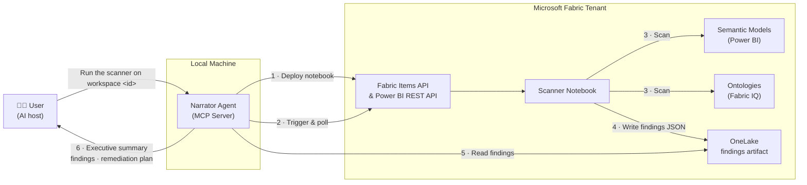

# Fabric Modeling Readiness Assessor

**Who this is for:** Data architects and platform engineers preparing a Microsoft Fabric workspace for Fabric IQ (AI-powered Q&A and analytics). Before AI can answer questions about your data, your semantic models and ontologies need to be modeled correctly. This tool tells you exactly where the gaps are—and what to do about them.

**What it does:** Tell the narrator agent your workspace ID and it handles everything. Within fifteen minutes a findings artifact is sitting in OneLake — a versioned JSON document scoring your tenant across four modeling disciplines, with every finding traced back to the specific semantic model or ontology that produced it. The agent then walks you through the results:
- An **executive summary** scoring your workspace across four modeling disciplines
- A **findings report** grouped by pattern, with specific models and fields called out
- A **remediation plan** your team can execute against

**How it works:** You open your AI host (VS Code + GitHub Copilot, Claude Code, or Cursor), clone this repo, and tell the agent to run the scanner on your workspace. The agent deploys and triggers the scanner notebook via the Fabric API, polls until it completes, and reads the findings from OneLake to guide the assessment conversation. The notebook runs entirely inside Fabric using the Power BI REST API and Fabric IQ APIs — authenticated as you, with your existing workspace permissions. No new Entra app registration. No admin consent. No data leaves the tenant.

## Architecture



---

## What the scanner is actually looking for

AI doesn't read your data—it reads *how your data is described*. If those descriptions are inconsistent, incomplete, or missing, the AI gives wrong answers or refuses to answer at all. The scanner checks four things:

### 1. Are the same concepts defined the same way everywhere?

Your organization probably has multiple reports, dashboards, and datasets. Each one has its own definition of "Customer," "Order," or "Revenue." If those definitions disagree—different keys, different join logic, different names for the same thing—the AI gets confused about which one to trust.

The scanner looks across all your semantic models and flags cases where the same real-world concept appears to be defined inconsistently. Think of it like spell-checking, but for your data's logic.

### 2. Can you trace where each number came from?

When an AI tells you "Q3 revenue was $4.2M," can it say *where* that number came from? Which source system? Which table? Which transformation?

Fabric IQ has a standard way to record that provenance—essentially a chain of custody for every field. The scanner checks whether your ontology entities have that provenance information attached. When it's missing, the AI can produce answers but can't explain them, which breaks trust with anyone who needs to verify the output.

### 3. Is the data organized in layers?

Best-practice data platforms organize data in stages: raw data comes in, gets cleaned, then gets shaped into business-ready form. When those stages are missing or collapsed together, AI has a harder time distinguishing "the number as it arrived" from "the number after we applied business rules." The scanner looks for layer vocabulary (bronze/raw, silver/clean, gold/curated, and common synonyms) in your semantic model table names.

### 4. Is there a process for catching and correcting data quality issues?

AI systems that answer questions about data need a way to learn when their answers were wrong. Steward-loop modeling checks whether your data platform has feedback mechanisms—review processes, exception queues, correction workflows—that close the loop between an AI answer and the human who validates it. The scanner looks for stewardship vocabulary (correction, feedback, audit, quality score, exception, flag, etc.) in your semantic model tables, measures, and ontology entities.

---

## Getting Started

There are two ways to get started. The first is the fastest—just open your AI host and talk to it.

---

### Path A — Tell the agent, it handles everything *(recommended)*

If you have VS Code with GitHub Copilot (or Claude Code or Cursor), the agent does the full setup and scan for you.

**1. Clone and open in VS Code**

```bash
git clone https://github.com/juichiache/fabric-modeling-readiness-assessor.git
cd fabric-modeling-readiness-assessor
code .
```

**2. Open Copilot Chat in Agent mode and say:**

> Run the scanner on workspace `<your-workspace-guid>`

That's it. The agent will run bootstrap, deploy the scanner notebook to your Fabric workspace via the Fabric API, poll until it completes, and start the assessment conversation automatically. You'll be prompted to sign in with your Microsoft account when needed (device code flow — no admin consent required).

**You'll need:**
- Your Fabric workspace GUID (find it in the URL: `https://app.fabric.microsoft.com/groups/<this-part>/...`)
- Fabric Contributor permissions on that workspace (to deploy and run the notebook)

**What the agent does behind the scenes:**
1. Installs the narrator's Python dependencies and registers the MCP server
2. Uploads `scanner/modeling-readiness-scanner.ipynb` to your Fabric workspace via the Fabric Items API
3. Triggers the notebook run and polls until it completes (≈ 15 min)
4. Reads the findings artifact from OneLake
5. Starts the assessment — executive summary, findings by pattern, remediation plan

When you're done with the assessment conversation, ask:

> Write deliverables.

The agent produces an executive summary, findings report, and remediation plan in an `assessments/` folder.

---

### Path B — Manual setup

Follow these steps if you prefer to configure things yourself before running the agent.

**Prerequisites:**
- Fabric workspace with Contributor permissions
- Python 3.11+ on your local machine
- VS Code with [GitHub Copilot](https://marketplace.visualstudio.com/items?itemName=GitHub.copilot), or Claude Code, or Cursor

#### Step 1 — Clone the repository

```bash
git clone https://github.com/juichiache/fabric-modeling-readiness-assessor.git
cd fabric-modeling-readiness-assessor
```

#### Step 2 — Run bootstrap

Bootstrap installs the narrator's Python dependencies and registers the MCP server with your AI host automatically.

**Windows:**
```powershell
.\bootstrap.ps1
```

**macOS / Linux:**
```bash
chmod +x bootstrap.sh && ./bootstrap.sh
```

Follow the prompts. When it finishes, you'll see confirmation that the MCP server is registered.

#### Step 3 — Configure the narrator

Edit `narrator.config.yaml`:

```yaml
workspace_url: "https://app.fabric.microsoft.com/groups/<your-workspace-guid>/..."
```

#### Step 4 — Run the scanner

Open VS Code in the repository folder, open Copilot Chat in **Agent mode**, and say:

> Run the scanner on workspace `<your-workspace-guid>`

The agent deploys the scanner notebook to Fabric, triggers it, polls until complete, and confirms when the findings artifact is ready in OneLake. You'll be prompted to sign in with your Microsoft account (device code — no admin consent required).

#### Step 5 — Start the assessment

> Assess this workspace.

The narrator reads the findings artifact and guides you through the results. When you're done:

> Write deliverables.

The agent produces an executive summary, findings report, and remediation plan in an `assessments/` folder.

---

### Manual notebook run *(fallback)*

If you prefer to run the scanner notebook directly in the Fabric portal:

1. In the Fabric portal, go to your workspace → **Import** → **Notebook**
2. Import `scanner/modeling-readiness-scanner.ipynb`
3. Open the imported notebook
4. **Run Cell 0** — installs the scanner library. Restart the kernel when it completes.
5. In **Cell 1**, set your workspace details:
   ```python
   WORKSPACE_ID = "your-workspace-guid"
   WORKSPACE_URL = "https://app.fabric.microsoft.com/groups/your-workspace-guid/..."
   ```
6. Run all remaining cells top-to-bottom

When the final cell completes, the findings artifact is in `Files/modeling-readiness/<run-id>/` in your OneLake. Then open your AI host, open Copilot Chat in Agent mode, and say:

> Assess this workspace.

---

## What gets assessed

| Discipline | What it detects |
|------------|-----------------|
| **Canonical entity modeling** | Inconsistent entity definitions across semantic models (mismatched keys, join logic, naming) |
| **Field-level lineage** | Missing source-attribution properties in Fabric IQ ontology entity types |
| **Layered modeling** | Absence of bronze/silver/gold staging layers |
| **Steward-loop modeling** | Absence of data stewardship feedback loops |

### Scoring

| Findings count | Score | Label |
|----------------|-------|-------|
| 0 | 4 | Excellent |
| 1–2 | 3 | Good |
| 3–5 | 2 | Fair |
| 6–10 | 1 | Poor |
| 11+ | 0 | Critical |

Disciplines without detectable signals are reported as "not assessed in this version."

---

## Supported AI hosts

| Host | Setup |
|------|-------|
| VS Code + GitHub Copilot | Automatic (bootstrap writes `.vscode/mcp.json`) |
| Claude Code | Automatic (bootstrap writes `claude_mcp_config.json`) |
| Cursor | Automatic (bootstrap writes `.cursor/mcp.json`) |

---

## Configuration reference

`narrator.config.yaml`:

| Field | Default | Description |
|-------|---------|-------------|
| `workspace_url` | `""` | Fabric workspace URL — required |
| `token_cache` | `false` | Cache MSAL tokens in `.narrator-token-cache` (gitignored) |
| `similarity_threshold` | `0.85` | Entity name similarity threshold `[0.5, 1.0]` |
| `demo_workspace` | `false` | Set `true` only when running the provisioner/teardown notebooks |

---

## Troubleshooting

**"WORKSPACE_ID not set" error in the notebook**  
Set `WORKSPACE_ID` and `WORKSPACE_URL` in Cell 1 before running.

**Cell 0 pip install fails in Fabric**  
Make sure `REPO_URL` in Cell 0 points to the correct GitHub URL for this repo. The repo must be publicly accessible or reachable from the Fabric notebook runtime.

**MCP server not appearing in VS Code**  
Rerun bootstrap. If VS Code was open during bootstrap, reload the window (`Ctrl+Shift+P` → *Developer: Reload Window*).

**"No findings artifact" error from the narrator**  
The scanner notebook must complete successfully first. Check that `Files/modeling-readiness/` exists in your OneLake and that `narrator.config.yaml` has the correct `workspace_url`.

**Authentication prompt on first narrator run**  
The narrator uses Microsoft Entra device-code flow to read OneLake (read-only scope). Follow the prompt to sign in. Set `token_cache: true` in `narrator.config.yaml` to avoid re-authenticating on every run.

---

## What you can build on top of this

The framework is designed to be extended:

- **Add disciplines.** Each discipline is a discrete module in `scanner/lib/scanner/`. Add vertical-specific entities or deeper signals without touching the rest.
- **Consume findings downstream.** Findings emit as structured JSON (`findings.json` in OneLake). Downstream agents—remediation trackers, Planner integrations, empirical assessors—can read them directly.
- **Adopt the framework without the agent.** The four disciplines and ten patterns are documented independently in `docs/patterns.md`. Usable on their own without running the agent.

---

## Development

```powershell
# Install dev dependencies
pip install pytest pytest-cov rapidfuzz pyyaml msal azure-storage-file-datalake jinja2

# Run tests
$env:PYTHONPATH = "."
python -m pytest tests/ -q
```

---

## License

MIT — see [LICENSE](LICENSE).
